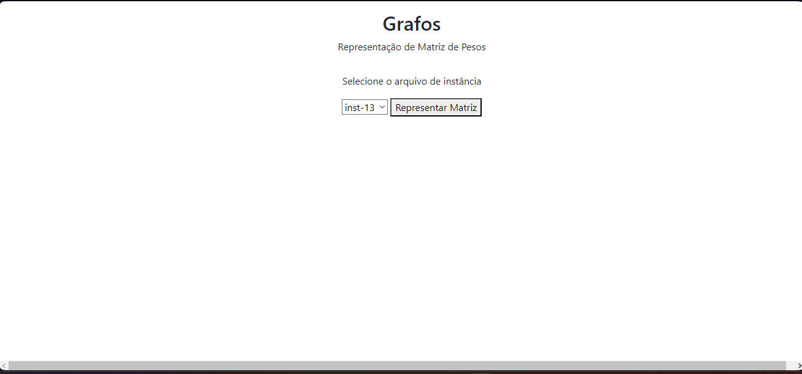
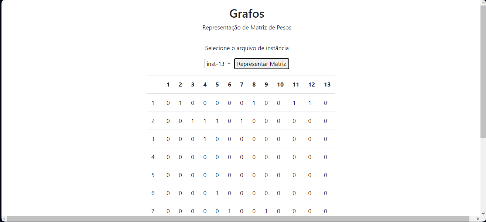

# Aplicação simples de representação de matriz de pesos 

## Descrição do projeto

  O projeto consiste em uma aplicação simples de representação de matriz de pesos, onde é possível selecionar um arquivo de instância dentre os disponíveis e realizar a impressão da matriz de pesos.

  Backend: Python 3.8.10
  Fontend: Bootstrap 5
  API: Flask

## Como executar o projeto
  
  Para executar o projeto, é necessário ter o Python 3.8.10 instalado na máquina assim como o utilitário pip. Após isso, é necessário instalar as dependências do projeto, que estão listadas no arquivo requirements.txt. Para isso, basta executar o comando abaixo:

  ```bash
  pip install -r requirements.txt
  ```

  Após a instalação das dependências, basta executar o arquivo app.py, que está na raiz do projeto. Para isso, basta executar o comando abaixo:

  ```bash
  python app.py
  ```

  Após isso, basta acessar o endereço http://localhost:5000/ para visualizar a aplicação.

## Aplicação em Execução

  
  